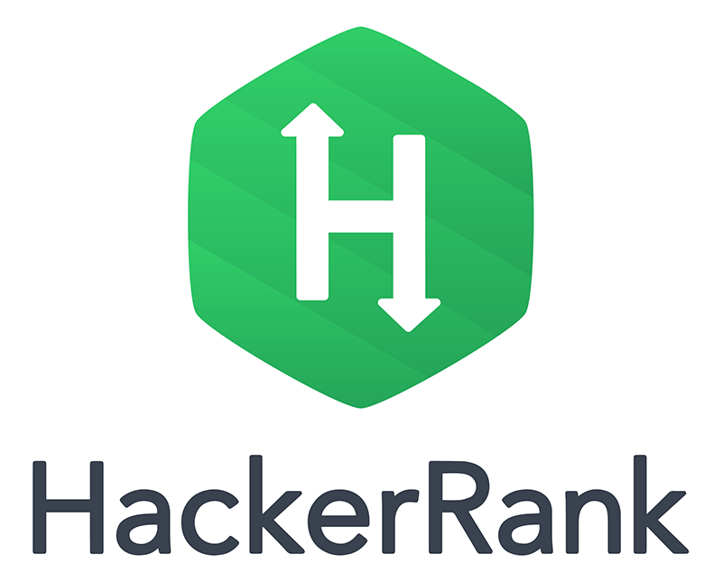

<h1 align="center"> Calendar Appointments </h1>

## About the Project

[Vanhack](#Vanhack) send all applicants challenges through [HackerRank](#HackerRank) in order to verify their coding skills. This specific challende was to make a calendar app. The calendar should display all the dates for the current month. The calendar app should also be able to mark appointments. The app must have the following functionality:

- Any appointment can be made for the current day or for a future date.
- No two appointments should overlap. If an appointment already exists for a day, a warning should be shown.
- Appointments can be edited and deleted.

## How to

To run this project you just have to [clone](https://help.github.com/articles/cloning-a-repository/) this repo in your desired folder and access the index file.

## Technologies used in this project

- [Javascript](https://developer.mozilla.org/en-US/docs/Web/JavaScript)
- [LocalStorage](https://developer.mozilla.org/en-US/docs/Web/API/Storage/LocalStorage)
- [Bootstrap](https://getbootstrap.com/)
- [Jquery](https://jquery.com/)
- [Inputmask](https://robinherbots.github.io/Inputmask/)
- [iziToast](http://izitoast.marcelodolce.com/)
- [Fontawesome](https://fontawesome.com/)

## About the companies

### Vanhack

> VanHack is a network of the world’s top software engineering, design, and digital marketing talent - available on demand to relocate to help companies grow. With over 180,000 members from 73 countries, VanHack is the largest workforce that is ready to relocate in the world.

visit their website [here](https://www.vanhack.com)

### HackerRank

> HackerRank is a technology hiring platform that is the standard for assessing developer skills for over 1,000 companies around the world. By enabling tech recruiters and hiring managers to objectively evaluate talent at every stage of the recruiting process, HackerRank helps companies hire skilled developers and innovate faster.

visit their website [here](https://www.hackerrank.com)